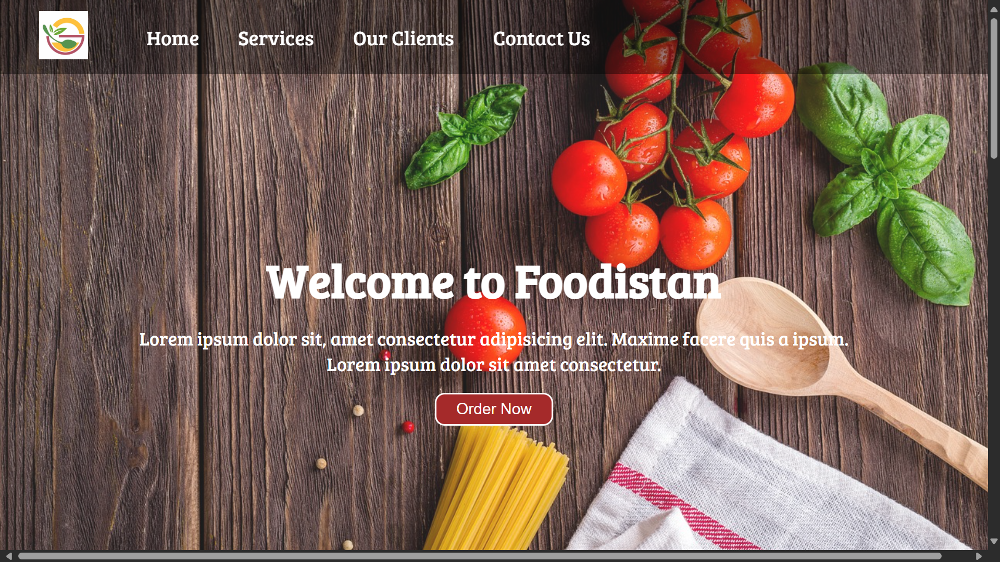
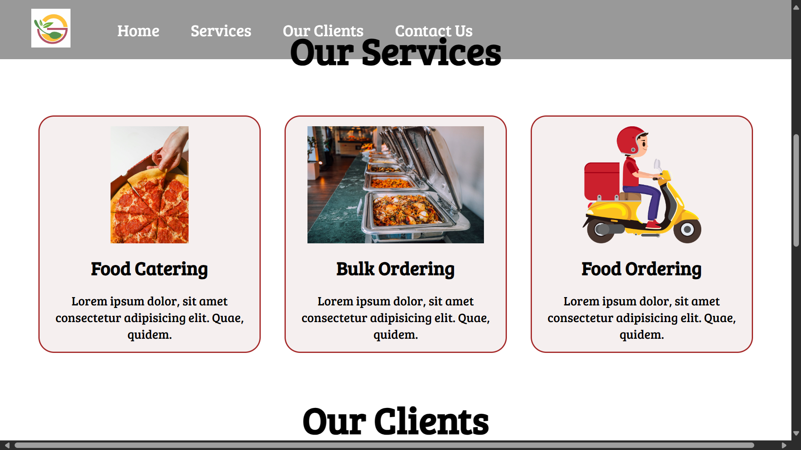

# Foodistan - Food Order

## Overview
Welcome to Foodistan, your one-stop online food ordering platform! Foodistan is designed to simplify the process of ordering food, making it quick and convenient for users.

## Project URL
You can access the live version of the website here: [Foodistan - Food Order](https://foodistan-food-order.netlify.app/)

## Screenshots
Here are some screenshots of the Foodistan website in action:

## Technologies
Foodistan is built with the following technologies:
- **HTML**
- **CSS**

## Features
- Easy food ordering process
- User-friendly interface
- Quick order processing
- Responsive design for mobile and desktop

## Project Setup
If you'd like to run the project locally or contribute to it, follow these steps:
1. Clone the repository: `git clone <repository-url>`
2. Navigate to the project directory: `cd foodistan-food-order`
3. Open the project in a browser or use a local development server to view it.

## Contributing
Contributions are welcome! If you'd like to contribute to this project, please follow these steps:
1. Fork the repository.
2. Create a new branch for your changes.
3. Make your changes and commit them.
4. Create a pull request with a detailed explanation of your changes.

## Contact
If you have any questions or suggestions, feel free to contact me at [bilalchanna67@gmail.com](mailto:bilalchanna67@gmail.com).
